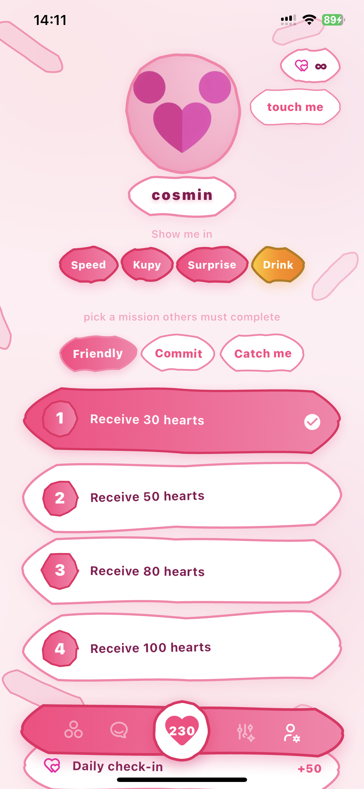
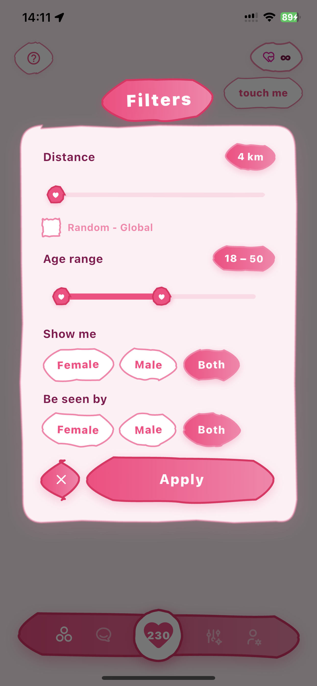
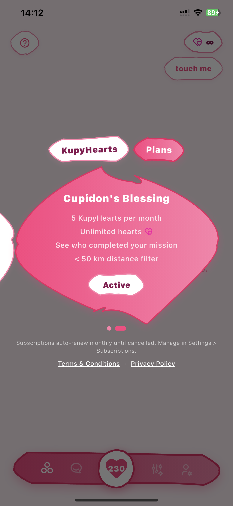

# Kupy — Dating App

A Flutter dating app where users complete missions to unlock conversations. Built with Supabase for real-time backend and Firebase for push notifications. Features a custom hand-drawn UI system, 4 dating modes, in-app purchases, and face verification.

> Launching soon on iOS & Android

## Preview

  
  
  

  
  

## Tech Stack

- **Flutter** (Dart) — Cross-platform iOS & Android
- **Supabase** — Auth (email OTP), PostgreSQL database, Realtime subscriptions, Storage
- **Firebase** — Cloud Messaging (push notifications), background message handling
- **In-App Purchases** — Consumables + auto-renewable subscriptions (App Store & Google Play)
- **Geolocator** — Location-based user filtering with Haversine distance
- **Camera** — Front-facing selfie capture for face verification
- **Audioplayers** — Match sound effects
- **Klipy** — GIF/sticker picker in chat

## How It Works

Users don't just swipe — they complete missions to prove interest. Each user pair gets assigned a mission (e.g. "send 50 likes over 5 days"). When both sides complete their mission, chat unlocks. This creates real engagement instead of empty matches.

### Dating Modes
